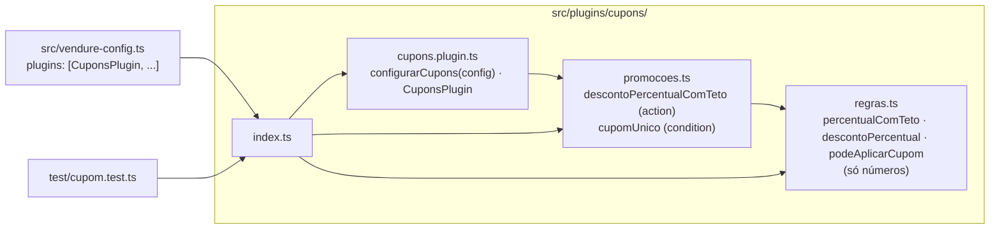

# Plano: plugin `cupons` (SPEC.md)

Plano em arquivo, escrito antes de implementar (curso, seção 3 · Sessão, compactação e subagents, aula «Planejamento primeiro»). Prompt que gerou este plano, em sessão nova e fora do plan mode:

```
Leia AGENTS.md, SPEC.md, test/cupom.test.ts e os exemplos oficiais citados no AGENTS.md.
Escreva o plano de implementação em docs/plano.md: arquivos, ordem, qual regra (R1..R7)
cada passo cobre, como verificar e perguntas abertas. Não implemente.
```

## O que já existe e vou reaproveitar

- `PromotionOrderAction` e `PromotionCondition` de `@vendure/core`, no mesmo formato de `order-percentage-discount-action.js` e `min-order-amount-condition.js`.
- `test/cupom.test.ts` já importa `descontoPercentualComTeto`, `cupomUnico` e `configurarCupons` de `src/plugins/cupons`: os nomes estão decididos pelo teste.
- A `Promotion` nativa cuida de código, datas e limites de uso. Nada disso entra no plugin.

## Desenho



## Passos

| # | Arquivo | O que faz | Regras |
|---|---|---|---|
| 1 | `src/plugins/cupons/regras.ts` | `TETO_PERCENTUAL = 30`; `percentualComTeto(pct)` = `min(max(pct, 0), 30)`; `descontoPercentual(base, pct)` com `Math.round`; `podeAplicarCupom({ couponCodes, lines })`. Sem importar o Vendure. | R1, R2, R3 (pct negativo = 0), R5, R6 |
| 2 | `src/plugins/cupons/promocoes.ts` | `descontoPercentualComTeto`: `PromotionOrderAction`, arg `pct` (int), base por `ctx.channel.pricesIncludeTax`, devolve `-descontoPercentual(base, pct)`. `cupomUnico`: `PromotionCondition` sem args, `check` chama `podeAplicarCupom`. `code` snake_case, `description` pt_BR e en. | R1–R6, R7 (nomes) |
| 3 | `src/plugins/cupons/cupons.plugin.ts` | `configurarCupons(config)` acrescenta aos arrays existentes de `config.promotionOptions` (spread, sem substituir). `CuponsPlugin` com `configuration: configurarCupons`. | R7 |
| 4 | `src/plugins/cupons/index.ts` | Reexporta os três arquivos. | |
| 5 | `src/vendure-config.ts` | Importa `CuponsPlugin` e põe no array `plugins`. Tira o `TODO(Fulano)` dos cupons. | R7 |

## Verificação

1. `npm test`: os 10 testes de `test/cupom.test.ts` e os 5 antigos verdes, sem mexer nos testes.
2. `npx tsc --noEmit`: tipos do plugin e do registro no `vendure-config.ts`.
3. `git status --short`: só `src/plugins/cupons/`, `src/vendure-config.ts` e este plano.
4. Subagente `revisor-codigo` com o diff contra o `SPEC.md`.

## Fora do escopo (a spec proíbe)

Entidade, migration, resolver, validação de código ou de data do cupom, mudança em `src/misc/preco.ts`, dependência nova.

## Perguntas abertas

- **`pct` negativo:** a spec só dizia "nunca positivo" (R3). Decidi tratar como 0 e registrei a frase na R3; se o financeiro preferir erro de configuração, muda a `regras.ts` e ganha um teste.
- **Teto nas actions nativas:** a spec pede para somar às nativas, então `order_percentage_discount` continua aceitando 100%. Os testes não pegam isso. Registrado em "O que o verde não prova" do `SPEC.md` para decisão do financeiro.
